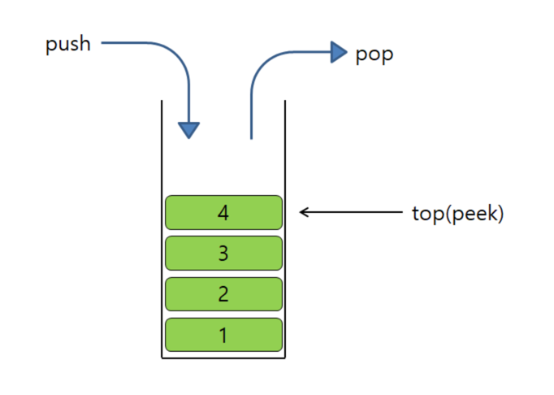
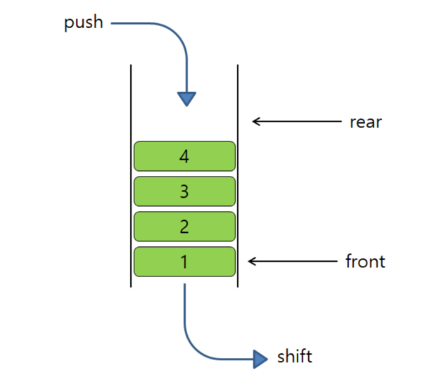
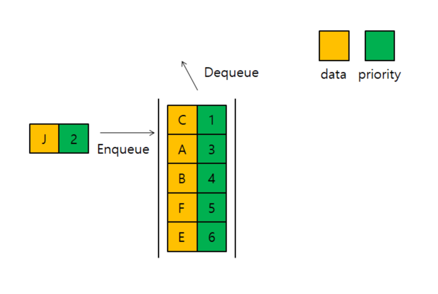

# 2주차 주제 - 스택/큐

## 스택이란?
- 스택은 가장 마지막에 들어온 데이터를 가장 먼저 삭제하는 후입선출(LIFO) 방식입니다.
- 한쪽방향으로 데이터를 삽입/삭제를 할 수 있습니다.
- 삽입/삭제에 대한 시간 복잡도는 O(1)이고 탐색은 O(N)입니다.
### 스택 용어
- top(peek) : 가장 나중에 삽입된 데이터이자 가장 먼저 삭제될 데이터를 의미합니다.
- push : top에 데이터를 삽입합니다.
- pop : top에 있는 데이터를 삭제할때 사용합니다.

## 큐란?
- 스택과 달리 한쪽에서 데이터를 삽입하고 다른쪽에서는 데이터를 삭제하는 방식입니다.
- 가장 먼저 들어온 데이터가 가장 먼저 삭제되는 선입선출(FIFO) 방식입니다.
- 삽입/삭제시 시간복잡도는 O(1)이고 탐색은 O(N)입니다.

### 큐의 용어
- Enqueue : 데이터 삽입
- Dequeue : 데이터 삭제
- Front : Dequeue시 삭제되는 데이터, 가장 먼저 저장된 데이터
- Rear : 추가될 새로운 요소의 위치

### 사용되는 예
- BFS 알고리즘
- 프로세스 관리
- 프린터의 대기열

## 큐의 다른 종류
- 우선 순위 큐
  - 값과 우선순위 총 2개의 데이터를 가지고 있습니다.
  - 우선순위가 높은 요소일수록 먼저 삭제되는 특징을 가지고 있고 우선순위가 같은 데이터일 경우 삽입순서에 따라 삭제가 됩니다.
  - 삽입/삭제 시 우선순위에 따라 요소들을 정렬해야 하기때문에 주로 "힙"이라는 자료구조로 구현됩니다.
  - 우선순위 큐는 어떻게 규현하느냐에 따라 시간복잡도가 달라지지만 힙의 기준으로 한다면 삽입과 삭제에는 시간 복잡도 O(logN)을 가지고 우선순위가 가장 높은 요소를 탐색할때는 O(1)만쿰의 시간복잡도를 가집니다.

<table>
    <thead board="1">
        <td>플랫폼</td>
        <td>레벨</td>
        <td>날짜</td>
        <td>문제</td>
    </thead>
    <tbody board="1">
        <tr>
            <td>프로그래머스</td>
            <td>2 Level</td>
            <td>2024.04.17</td>
            <td>
            <a href="https://school.programmers.co.kr/learn/courses/30/lessons/42587">프로세스</a>
            </td>
        </tr>
    </tbody>
</table>
